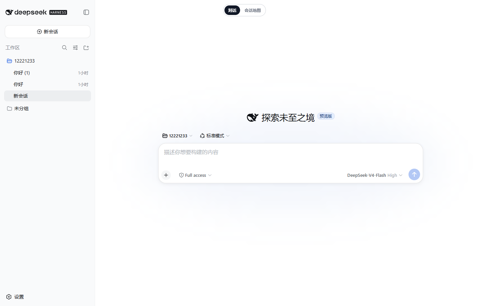

# dsh-synapse


**A visual, non-linear conversation workspace plugin for DeepSeek Harness.**

鎶婂悓涓€宸ヤ綔鍖轰腑鐨勪細璇濄€佽拷闂拰鍒嗘敮缁勭粐鎴愬彲娴忚銆佸彲鎷栨嫿銆佸彲缂╂斁鐨勫璇濆湴鍥撅紝鍚屾椂淇濈暀 DSH 鍘熺敓鐨勪細璇濊兘鍔涖€?
> **杩欐槸绗笁鏂逛慨鏀圭増**锛屽熀浜庡師浣滆€?**liangmianya** 鐨勫紑婧愰」鐩?[dsh-synapse](https://github.com/liangmianya/dsh-synapse) 淇敼鑰屾潵锛岄伒寰?**MIT** 璁稿彲璇併€傝瑙佹枃鏈€屾潵婧愪笌鑷磋阿銆嶃€?
[涓枃鎸囧崡](docs/zh-CN/README.md) 路 [English guide](docs/en/README.md) 路 [Development](docs/development.md) 路 [Architecture](docs/architecture.md)


## Overview

`dsh-synapse` adds a visual session map to the native DeepSeek Harness Web interface. It projects committed DSH conversations into connected cards, keeps forks attached to their real branching turns, and synchronizes the current session between the map and native chat.

Synapse is an interface layer, not a second conversation system. DSH continues to own sessions, model requests, tools, permissions, and the Web server.

## Features

| | Feature | 鍔熻兘 |
|---|---|---|
| 馃椇锔?| Browse sessions and turns as a connected canvas | 灏嗕細璇濆拰杩介棶鏄剧ず涓鸿繛绾跨敾甯?|
| 馃尶 | Preserve native DSH fork lineage | 鎸夌湡瀹炲垎鍙夌偣鏄剧ず DSH 鍒嗘敮 |
| 馃搧 | Group sessions by DSH workspace and directory | 鎸夊伐浣滃尯鍜岀洰褰曠粍缁囦細璇?|
| 馃摜 | Project committed and streaming replies into cards | 灏嗗凡鎻愪氦鍜屾祦寮忓洖澶嶆姇褰卞埌鍗＄墖 |
| 馃敡 | Fold tool calls and results into assistant replies | 灏嗗伐鍏疯皟鐢ㄥ拰缁撴灉鎶樺彔鍒板姪鎵嬪洖绛?|
| 鈿?| Synchronize the active session with native chat | 涓?DSH 鍘熺敓瀵硅瘽鍙屽悜鍚屾褰撳墠浼氳瘽 |
| 馃帹 | Pan, zoom, drag, fold descendant subtrees, focus, and persist card positions | 鏀寔骞崇Щ銆佺缉鏀俱€佹嫋鍔ㄣ€佸睍寮€/鎶樺彔鍚庣画瀛愭爲銆佸畾浣嶅拰浣嶇疆淇濆瓨 |



## Quick start

Requirements: DeepSeek Harness with the profile plugin mechanism, Node.js `>= 22.19.0`, and the `web` profile.

```powershell
corepack pnpm dsh plugin --profile web add dsh-synapse
corepack pnpm dsh web
```

Open `http://127.0.0.1:3080/` and select **Session Map / 浼氳瘽鍦板浘** from the top switch.

> [!NOTE]
> Synapse extends the existing DSH Web profile. It does not start a second application server. The npm package needs no build permission; Git and local-checkout installs are documented in the installation guide.

## Documentation

| Document | Description |
|---|---|
| [涓枃鎸囧崡](docs/zh-CN/README.md) | 瀹夎銆佸惎鍔ㄣ€侀厤缃€佷娇鐢ㄣ€佸嵏杞藉拰宸茬煡闄愬埗 |
| [English guide](docs/en/README.md) | Installation, configuration, usage, cleanup, and limitations |
| [Development and releases](docs/development.md) | Local validation, GitHub Actions, version tags, and npm publishing |
| [Architecture and boundaries](docs/architecture.md) | Session ownership, projection, storage, model impact, and operational limits |

## Development

```powershell
corepack pnpm install --frozen-lockfile
corepack pnpm run build
corepack pnpm test
```

See the [development and release guide](docs/development.md) for CI/CD and npm publication details.

## Runtime boundaries

- DSH session logs remain the source of truth for conversation content.
- Synapse stores canvas metadata separately under `$DSH_HOME/synapse/`.
- Projected card text is capped at 8000 characters; the full message remains available in conversation details.
- The plugin does not modify prompts, model requests, tool schemas, provider routing, or reusable KV-cache prefixes.
- Only the DSH `web` profile is supported by the bundled patch.

See [Architecture and runtime boundaries](docs/architecture.md) for the complete model.

## 鏉ユ簮涓庤嚧璋?/ Credits

鏈慨鏀圭増鍩轰簬寮€婧愰」鐩?**dsh-synapse** 浜屾寮€鍙戯細

- 鍘熼」鐩細`dsh-synapse`
- 鍘熶綔鑰咃細**liangmianya**
- 鍘熶粨搴擄細<https://github.com/liangmianya/dsh-synapse>
- 鍘熻鍙瘉锛?*MIT**

鍘熼」鐩噰鐢?**MIT 璁稿彲璇?*锛屽厑璁镐换浣曚汉鍏嶈垂浣跨敤銆佷慨鏀广€佸垎鍙戯紙鍚晢涓氱敤閫旓級锛?*鍓嶆彁鏄繚鐣欑増鏉冧笌璁稿彲璇佸０鏄?*銆傛湰鏂囦欢澶瑰凡淇濈暀鍘熷 `LICENSE` 鏂囦欢銆?
> **鍐嶅垎鍙戣娉ㄦ剰**锛?> 1. 淇濈暀 `LICENSE`锛圡IT锛変笌鏈〉鐨勨€滄潵婧愪笌鑷磋阿鈥濓紱
> 2. 鍦ㄦ樉鐪间綅缃敞鏄庡師椤圭洰鍙婃湰淇敼鐗堟潵婧愶紱
> 3. 鏈」鐩悕 / Logo锛坄deepseek-mark.svg`锛夋秹鍙婂晢鏍囷紝MIT 鍙鐩栦唬鐮侊紝涓嶄唬琛ㄥ畼鏂硅儗涔︼紝璇峰嬁鏆楃ず涓庡師鍘?/ 鍘熶綔鑰呭瓨鍦ㄥ畼鏂瑰叧鑱斻€?
## License

[MIT](LICENSE)
